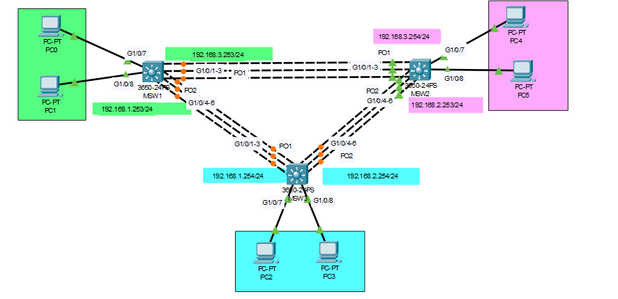

# EtherChannel Configuration with Layer 3 Switches

## Overview
This Packet Tracer lab demonstrates the configuration of EtherChannel on Layer 3 switches. EtherChannel bundles multiple physical links into a single logical link, enhancing bandwidth and providing redundancy. The switches in the topology are configured to use Layer 3 EtherChannel, which requires IP addresses on the port channels for inter-switch routing.

The lab includes:
- Configuring EtherChannel using Layer 3 (routed) port channels.
- Disabling switchport mode on the required interfaces.
- Enabling IP routing on each Layer 3 switch.

## Network Topology
The network consists of three multi-layer switches (MSW1, MSW2, and MSW3) connected via EtherChannel. Each switch connects to the others using multiple Gigabit interfaces grouped into port channels. PCs are connected to each switch, but their IP addresses are not yet configured.



## Switch Configurations

### MSW1 Configuration
- **Port Channel 1**: 
  - Interfaces: `G1/0/1-3`
  - IP Address: `192.168.3.253/24`
- **Port Channel 2**:
  - Interfaces: `G1/0/4-6`
  - IP Address: `192.168.1.253/24`

### MSW2 Configuration
- **Port Channel 1**:
  - Interfaces: `G1/0/1-3`
  - IP Address: `192.168.3.254/24`
- **Port Channel 2**:
  - Interfaces: `G1/0/4-6`
  - IP Address: `192.168.2.253/24`

### MSW3 Configuration
- **Port Channel 1**:
  - Interfaces: `G1/0/1-3`
  - IP Address: `192.168.1.254/24`
- **Port Channel 2**:
  - Interfaces: `G1/0/4-6`
  - IP Address: `192.168.2.254/24`

## Steps to Configure EtherChannel with Layer 3 Switches

### 1. Enable IP Routing on Each Switch
To ensure that the switches can route between different networks, IP routing must be enabled.

```bash
Switch(config)# ip routing
```

### 2. Disable Switchport Mode on Interfaces
Since EtherChannel will operate at Layer 3, the interfaces must not be in switchport mode. For each group of interfaces, disable `switchport` mode.

Example for **MSW1** (Port Channel 1, interfaces G1/0/1-3):

```bash
Switch(config)# interface range G1/0/1 - 3
Switch(config-if-range)# no switchport
```

Repeat for all the required interfaces on all switches.

### 3. Configure EtherChannel Groups

For each switch, group the appropriate interfaces into port channels using the `channel-group` command. For example, on **MSW1**:

- **Port Channel 1**: Group interfaces `G1/0/1 - 3`
  
  ```bash
  Switch(config)# interface range G1/0/1 - 3
  Switch(config-if-range)# channel-group 1 mode active
  ```

- **Port Channel 2**: Group interfaces `G1/0/4 - 6`

  ```bash
  Switch(config)# interface range G1/0/4 - 6
  Switch(config-if-range)# channel-group 2 mode active
  ```

### 4. Assign IP Addresses to the Port Channels
After configuring the port channels, assign IP addresses to the Layer 3 port-channel interfaces. 

- For **MSW1**:
  
  - **Port Channel 1 (192.168.3.253/24)**:
    
    ```bash
    Switch(config)# interface Port-channel 1
    Switch(config-if)# ip address 192.168.3.253 255.255.255.0
    Switch(config-if)# no shutdown
    ```

  - **Port Channel 2 (192.168.1.253/24)**:
    
    ```bash
    Switch(config)# interface Port-channel 2
    Switch(config-if)# ip address 192.168.1.253 255.255.255.0
    Switch(config-if)# no shutdown
    ```

  Repeat this step for **MSW2** and **MSW3** using their respective port channels and IP addresses.

### 5. Verify the Configuration
- Check that the port channels are correctly configured and active:
  
  ```bash
  Switch# show etherchannel summary
  ```

- Verify that the IP addresses are correctly assigned to the port-channel interfaces:
  
  ```bash
  Switch# show ip interface brief
  ```

### 6. Assign IP Addresses to PCs (optional)
After completing the EtherChannel configuration, you can assign IP addresses to the PCs to allow for network testing. 

---

## Key Concepts

- **EtherChannel**: A technology that allows multiple physical links to be bundled into a single logical connection. This increases available bandwidth and provides redundancy.
- **Layer 3 Switch**: A device that can perform both switching (Layer 2) and routing (Layer 3) functions. Used to route traffic between different VLANs or networks.
- **Port Channel**: A virtual interface that represents the aggregated bundle of physical interfaces in an EtherChannel configuration.

---

## Commands Summary

1. **Enable IP Routing**:
   ```bash
   ip routing
   ```

2. **Disable Switchport Mode**:
   ```bash
   no switchport
   ```

3. **Configure EtherChannel**:
   ```bash
   interface range G1/0/x - y
   channel-group <number> mode active
   ```

4. **Assign IP Address**:
   ```bash
   interface Port-channel<number>
   ip address <IP> <subnet mask>
   no shutdown
   ```

5. **Verification**:
   ```bash
   show etherchannel summary
   show ip interface brief
   ```

---

## Conclusion

This lab demonstrates the step-by-step configuration of EtherChannel using Layer 3 switches. By disabling switchport mode and enabling IP routing, the switches can route traffic between different networks using logical port-channel interfaces. Once IP addresses are assigned to the PCs, further network tests can be conducted.

---

Let me know if this covers all the steps or if you need further adjustments!
